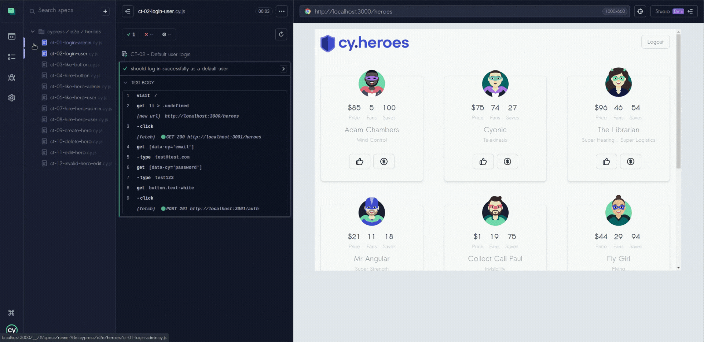

# Cypress End-to-End Test Automation — Cypress Heroes


---

## Test Automation Project

This repository contains automated end-to-end test scenarios developed using Cypress as part of the QA training program Guardião da Qualidade (LumeStack).

The project is based on Cypress Heroes, an open-source demo application created to support UI test automation practice through realistic user interactions such as authentication, hero management, and user engagement features.

The goal of this project is to demonstrate practical experience with automated testing by implementing organized and maintainable end-to-end tests, covering both positive and negative scenarios within a realistic application environment.

---

## About the Cypress Heroes

Cypress Heroes is an open-source demo application designed to support UI test automation practice through realistic frontend interactions.

The application simulates common user behaviors such as authentication, liking heroes, hiring heroes, and performing CRUD operations, making it a practical environment for learning and validating end-to-end testing strategies.

Original project repository:

https://github.com/cypress-io/cypress-heroes

---

## Testing Approach

This project was implemented using the Page Object Model (POM) pattern to improve test readability, reduce duplication, and keep page interactions separated from test logic.

The test suite focuses on validating real user workflows within the Cypress Heroes application, covering both positive and negative scenarios.

Page objects were used to encapsulate interactions such as login, liking heroes, hiring heroes, creating heroes, deleting heroes, and editing hero information, making the tests more maintainable and expressive.

---

## Technologies Used

- Cypress  
- JavaScript  
- Node.js

---

## Test Scenarios Covered

- Admin login
- Default user login
- Like button without authentication
- Hire button without authentication
- Like hero as admin
- Like hero as default user
- Hire hero as admin
- Hire hero as default user
- Create hero
- Delete hero
- Edit hero
- Invalid hero edit validation
  
---

## Demonstrated Test Scenarios

| Scenario | Scenario |
|----------|----------|
| CT-01 Admin login | CT-02 Default user login |
| CT-03 Like button without authentication | CT-04 Hire button without authentication |
| CT-05 Like hero as admin | CT-06 Like hero as default user |
| CT-07 Hire hero as admin | CT-08 Hire hero as default user |
| CT-09 Create hero | CT-10 Delete hero |
| CT-11 Edit hero | CT-12 Invalid hero edit validation |

---

### Authentication Flow (CT-01 / CT-02)

This scenario demonstrates user authentication using both the admin and default user accounts.



The tests validate successful login and correct access to authenticated features.

---

### Interaction Without Authentication (CT-03, CT-04)

This scenario validates application behavior when a user attempts to interact with heroes without being authenticated.

The tests confirm that protected actions such as liking and hiring heroes require login.

---

### Hero Interaction — Like Actions (CT-05, CT-06)

These scenarios validate the ability for authenticated users to like heroes within the application.

Both the admin and default user accounts interact with the hero list and perform the like action.

The tests ensure that the system correctly registers user interactions and updates the interface to reflect the new like state.

---

### Hero Hiring Flow (CT-07, CT-08)

These scenarios demonstrate the hero hiring functionality available to authenticated users.

Both user roles interact with the hero interface and execute the hiring action.

The tests validate that the application correctly processes the hiring request and updates the system state accordingly.

---

### Hero Management — Creation & Deletion (CT-09, CT-10)

These scenarios validate the hero management workflow within the application.

The tests cover the creation of a new hero and the deletion of an existing one.

The automation ensures that the system correctly handles CRUD operations and reflects the changes in the user interface.

---

### Hero Editing & Validation (CT-11, CT-12)

These scenarios validate the hero editing functionality provided by the application.

Users modify hero information through the edit interface.

The tests verify both successful updates and validation behavior when invalid data is submitted.

---

## Project Structure

The automation project follows a structured organization to keep tests maintainable, readable, and scalable.

The test suite is organized using the Page Object Model (POM) pattern, separating page interactions from test logic and improving code reuse.

```bash
cypress/
├── e2e/
│   └── heroes/
│       ├── ct-01-login-admin.cy.js
│       ├── ct-02-login-user.cy.js
│       ├── ct-03-like-button.cy.js
│       ├── ct-04-hire-button.cy.js
│       ├── ct-05-like-hero-admin.cy.js
│       ├── ct-06-like-hero-user.cy.js
│       ├── ct-07-hire-hero-admin.cy.js
│       ├── ct-08-hire-hero-user.cy.js
│       ├── ct-09-create-hero.cy.js
│       ├── ct-10-delete-hero.cy.js
│       ├── ct-11-edit-hero.cy.js
│       └── ct-12-invalid-hero-edit.cy.js
├── fixtures/
│   ├── example.json
│   └── userData.json
├── pages/
│   ├── createHeroPage.js
│   ├── deleteHeroPage.js
│   ├── editHeroPage.js
│   ├── hireHeroPage.js
│   ├── likeHeroPage.js
│   └── loginPage.js
├── support/
│   ├── commands.js
│   └── e2e.js
cypress.config.js
package.json
```

Each directory has a specific role in the test architecture:

- **e2e** – contains the automated end-to-end test scenarios  
- **pages** – implements the Page Object Model abstraction for UI interactions  
- **fixtures** – stores reusable test data  
- **support** – contains custom commands and global Cypress configuration  
- **docs/gifs** – stores demonstration animations used in the README  

---

## How to Run the Tests

This project uses Cypress to execute automated end-to-end tests against the Cypress Heroes application.

Follow the steps below to execute the automated tests locally.

### 1. Clone the repository

```bash
git clone https://github.com/pedrogitahy-qa/cypress-heroes-tests
cd cypress-heroes-tests
```

### 2. Install dependencies

```bash
npm install
```

###3. Open Cypress Test Runner

```bash
npx cypress open
```

###4. Run tests in headless mode

```bash
npx cypress run
```

---

## Test Coverage

The automation suite validates the main user flows of the Cypress Heroes application.

Covered functionalities include:

- Authentication flows  
- Hero interaction actions  
- Hero creation and deletion  
- Hero editing and validation scenarios  
- UI interaction validation  

These scenarios ensure coverage of the main user interactions available in the Cypress Heroes application, validating both successful flows and validation behavior.

---

## Automation Strategy

The test suite was designed with maintainability and readability in mind.

Key design decisions include:

- Use of the Page Object Model (POM) pattern  
- Separation between test logic and UI interactions  
- Reusable fixtures for test data  
- Scenario-based test organization  

This strategy ensures that the test suite remains organized, scalable, and easy to maintain while providing reliable validation of the core user interactions within the Cypress Heroes application.

---

